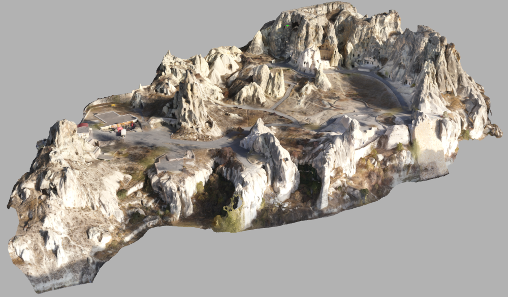
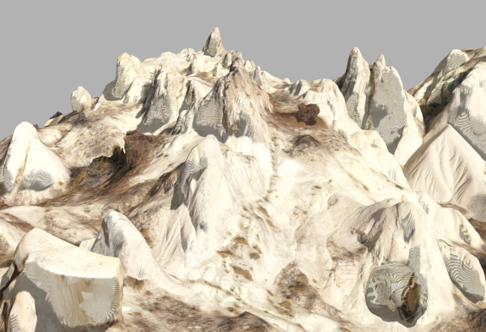
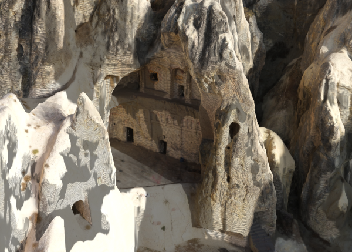

> [!IMPORTANT]
> This package has been updated to work with ROS 2 and the modern Gazebo simulator (e.g., Ignition/Harmonic).
> The original ROS 1 version of this package can be found at [https://github.com/altineller/cappa_gazebo](https://github.com/altineller/cappa_gazebo)

**Gazebo package for simulation of robots in Göreme National Park and the Rock Sites of Cappadocia, a UNESCO World Heritage Site:** [https://en.wikipedia.org/wiki/Cappadocia](https://en.wikipedia.org/wiki/Cappadocia)



**Why:** 

1. Much more interesting than mars surface for robotic experiments
2. Challenging surface, with differences in elevation
3. A very cool, historic place

Below is example rocky terrain. Differences in elevation make it very challenging but possible for a UGV or quadruped to operate.



It has historical artifacts such as rock churches, underground houses, with interconnected tunnels. Unfortunately, the 3D mesh do not contain those details.



**Interesting places to spawn your robot**

This will place the robot in one of the highest points, where you can try to navigate to flatland without falling down.

```
<arg name="x" default="93.03"/>
<arg name="y" default="-58.29"/>
<arg name="z" default="54.0"/>
<arg name="R" default="0.0"/>
<arg name="P" default="0.0"/>
<arg name="Y" default="3.14"/>
```

**Credits**

The 3d mesh and texture was obtained from https://sketchfab.com/3d-models/goreme-ack-hava-muzesi-kapadokya-nevsehir-c9a3f745da944741babf3ff157a8384d

*Geopilot Havadan Haritalama* @ sketchfab

**License**

[](https://creativecommons.org/licenses/by-sa/4.0/)
